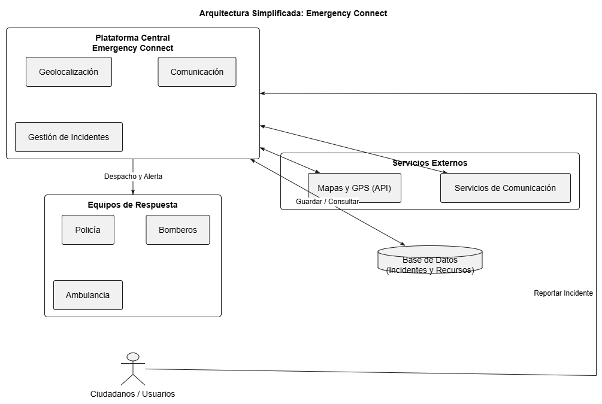
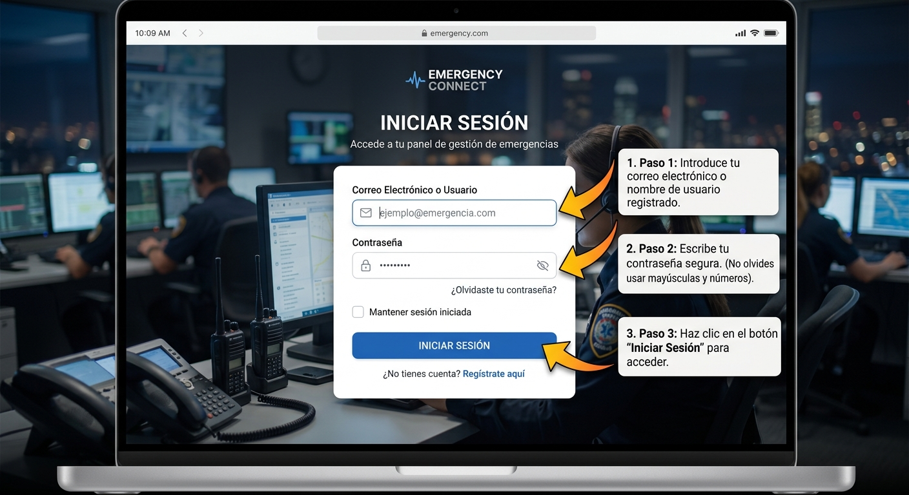
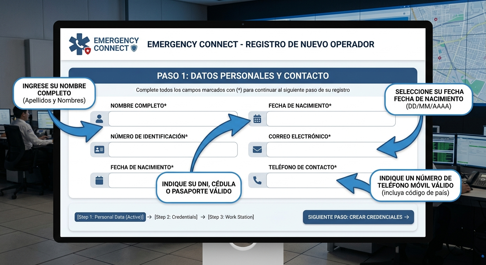

# Guía Visual de Navegación y Uso de la Aplicación[cite: 9]

Bienvenido a la guía de uso de la aplicación. Este manual te explicará paso a paso cómo utilizar las funciones principales de forma rápida y sencilla.[cite: 9]

---

## 1. Mapa General de Navegación[cite: 9]
A continuación se muestra el recorrido visual de las pantallas dentro de la aplicación:[cite: 9]

[cite: 9]

---

## 2. Paso a Paso: Cómo Iniciar Sesión[cite: 9]

Para acceder a tu cuenta en la aplicación, realiza las siguientes acciones:[cite: 9]

[cite: 9]

1. **Correo Electrónico (1):** Ingresa la dirección de correo con la que creaste tu cuenta.[cite: 9]
2. **Contraseña (2):** Escribe tu clave de acceso personal.[cite: 9]
3. **Boton 'Ingresar' (3):** Presiona el botón azul para entrar a tu pantalla principal.[cite: 9]

> **Sugerencia:** Si olvidaste tu clave de acceso, toca el enlace **"¿Olvidaste tu contraseña?"** para recuperarla.[cite: 9]

---

## 3. Paso a Paso: Cómo Registrar Información[cite: 10]

[cite: 10]

1. **Seleccionar Opción:** Toca el icono **"+"** ubicado en la esquina superior derecha.[cite: 10]
2. **Completar Formulario:** Llena los campos marcados como obligatorios.[cite: 10]
3. **Confirmar:** Presiona **"Guardar"** para almacenar los cambios.[cite: 10]